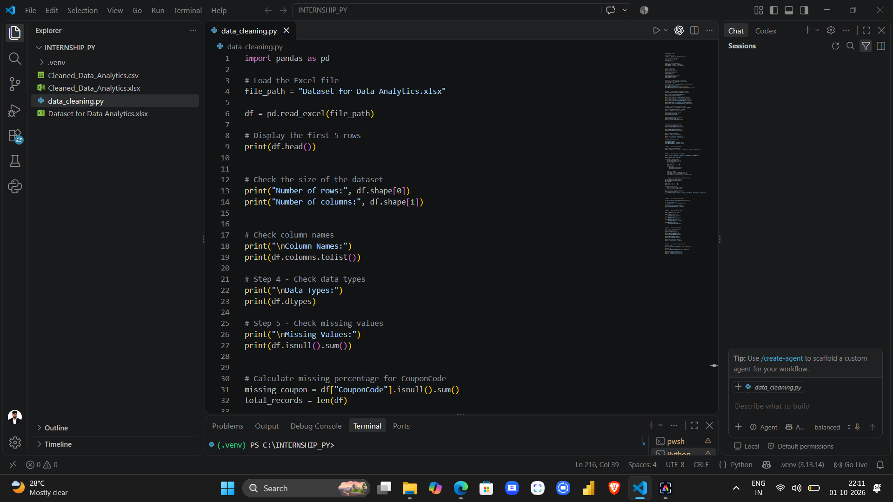
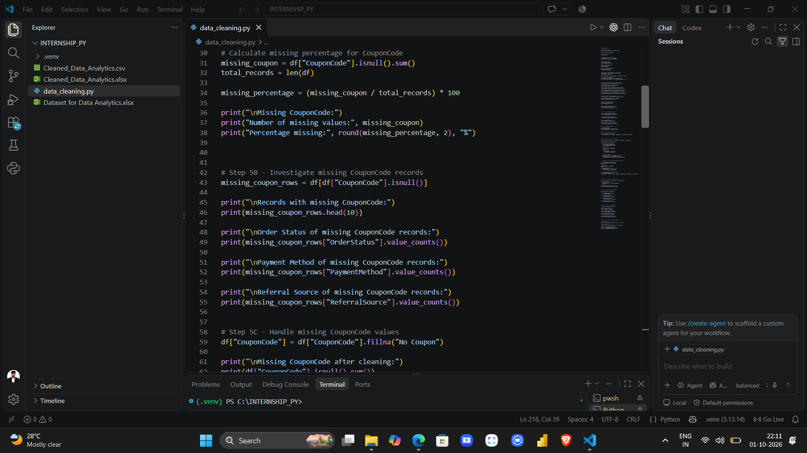
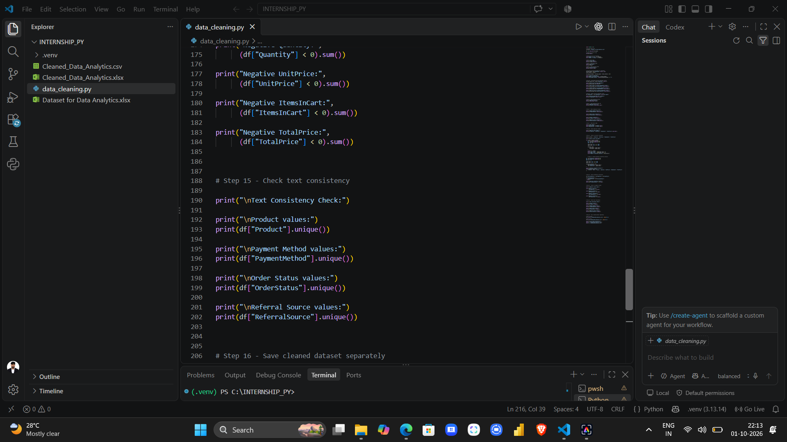
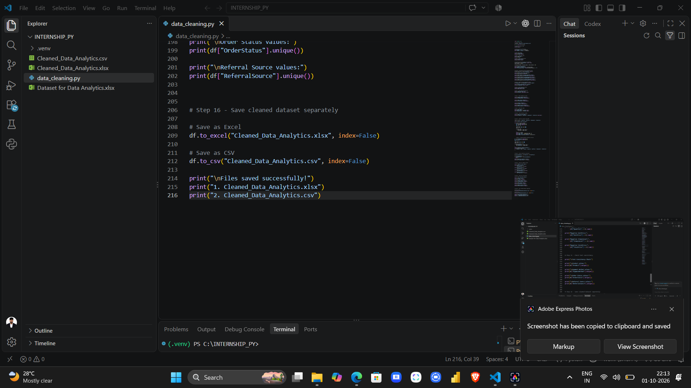

# 📊 Data Cleaning Project

## 📌 Project Overview

This project focuses on cleaning, validating, and preparing a raw dataset for further data analysis.

As part of my Data Analytics Internship with **DecodeLabs**, I worked on identifying data-quality issues and preparing a cleaner, analysis-ready dataset using Microsoft Excel and Python (Pandas).

The project demonstrates practical data-cleaning techniques, including missing-value analysis, duplicate detection, categorical data validation, numerical validation, outlier detection, and data export.

The main objective was to improve data quality and create a reliable dataset for future analysis.

---

## 🎯 Project Objectives

- Understand and explore the raw dataset.
- Identify missing values and investigate their impact.
- Calculate missing-value percentages.
- Investigate and handle missing `CouponCode` values.
- Identify duplicate records.
- Check duplicate `OrderID` values.
- Validate categorical data.
- Examine date ranges and potentially invalid dates.
- Perform numerical data validation.
- Identify potential outliers using the Interquartile Range (IQR) method.
- Verify the `TotalPrice` calculation.
- Check for negative numerical values.
- Review text consistency.
- Export the cleaned dataset into Excel and CSV formats.

---

## 🛠️ Tools and Technologies Used

| Tool | Purpose |
|---|---|
| Microsoft Excel | Data inspection, cleaning, and validation |
| Python | Data processing and cleaning |
| Pandas | Dataset manipulation and analysis |
| Visual Studio Code | Writing and executing Python code |
| GitHub | Project storage, documentation, and portfolio development |
| CSV | Storing cleaned data in a structured text format |
| Excel (.xlsx) | Storing cleaned data in spreadsheet format |

---

## 📂 Project Structure

```text
Task-1-Ankit-Kumar/
│
├── Data/
│   ├── Cleaned_Dataset_Python_Excel.xlsx
│   ├── Cleaned_Dataset_Python.csv
│   ├── Cleaned_Dataset_Python.xlsx
│   └── README.md
│
├── Screenshots/
│   ├── README.md
│   ├── img_1.png
│   ├── img_2.png
│   ├── img_3.png
│   └── img_4.png
│
├── Raw_Dataset.xlsx
├── data_cleaning.py
└── README.md
```

**Note:** The filenames and folders shown above reflect the intended organization of the repository. The actual files in the repository may differ slightly.

---

# 🔍 Data Cleaning and Validation Process

The project involved the following data-cleaning and validation steps.

## 1. Dataset Loading and Exploration

The first step was to load the raw dataset and examine its structure.

The initial exploration included:

- Displaying the first five records.
- Understanding the dataset structure.
- Checking the total number of rows.
- Checking the total number of columns.
- Reviewing the available fields.

This step helped establish an understanding of the dataset before performing any cleaning operations.

## 2. Checking Dataset Dimensions

The number of rows and columns was examined to understand the size of the dataset.

This step helps determine:

- The number of records available.
- The number of variables.
- Whether the dataset has the expected structure.
- Whether the dataset changes during cleaning.

## 3. Reviewing Column Names and Data Types

The column names and data types were reviewed to identify potential inconsistencies.

The checks included:

- Reviewing column names.
- Checking numerical data types.
- Checking text data types.
- Reviewing date-related fields.
- Identifying fields that might require type conversion.

Correct data types are important for calculations, filtering, grouping, and analysis.

## 4. Missing-Value Analysis

The dataset was examined to identify missing values in different columns.

The missing-value analysis included:

- Counting missing values in each column.
- Identifying columns containing missing information.
- Reviewing the extent of missing data.
- Determining which fields required further investigation.

Missing values must be investigated before deciding whether to retain, replace, or remove affected records.

## 5. Calculating Missing-Value Percentages

Missing-value percentages were calculated to understand the proportion of missing information in the dataset.

The formula used was:

```text
Missing Value Percentage =
(Number of Missing Values / Total Number of Records) × 100
```

This helps prioritize columns that may have significant data-quality issues.

## 6. CouponCode Investigation and Missing-Value Handling

Special attention was given to the `CouponCode` column.

The investigation included:

- Identifying records with missing `CouponCode` values.
- Counting missing coupon codes.
- Calculating the percentage of missing coupon codes.
- Examining related fields, including `OrderStatus`, `PaymentMethod`, and `ReferralSource`.
- Reviewing the appropriate treatment of missing coupon information.

Missing coupon codes may represent orders in which no coupon was used. However, this assumption should be verified against the dataset's business rules.

Where appropriate, a missing coupon value can be represented as `No Coupon`. Unknown or unavailable values should not automatically be treated as orders without coupons.

## 7. Duplicate Record Detection

The dataset was checked for duplicate records.

Duplicate detection helps identify repeated rows that may affect analysis and reporting.

The process included:

- Checking for completely duplicated records.
- Counting duplicate rows.
- Investigating potential duplicate entries.
- Reviewing whether duplicates should be removed.

Duplicate records should be investigated before deletion to avoid losing legitimate transactions.

## 8. Duplicate OrderID Validation

The `OrderID` field was examined to identify repeated order identifiers.

The purpose was to determine whether the dataset contained duplicate order IDs.

A repeated `OrderID` does not always indicate an error. The correct treatment depends on whether each row represents an individual order or an order line.

Therefore, duplicate identifiers should be investigated according to the dataset's structure and business rules.

## 9. Categorical Data Validation

Categorical fields were examined to identify inconsistent or unexpected values.

The fields reviewed included:

- `PaymentMethod`
- `OrderStatus`
- `Product`
- `ReferralSource`

The validation process included:

- Reviewing unique values.
- Identifying inconsistent labels.
- Checking for unexpected categories.
- Reviewing capitalization and spacing.
- Identifying potential spelling inconsistencies.

Consistent categorical values improve the reliability of grouping, filtering, aggregation, and visualization.

## 10. Date Validation

Date-related fields were reviewed to understand the time period covered by the dataset.

The process included:

- Reviewing date formats.
- Checking the overall date range.
- Identifying potentially invalid or unexpected dates.
- Examining whether dates were interpreted consistently.

Correct date formats are important for time-based analysis, trend identification, and reporting.

## 11. Numerical Data Validation

The numerical fields examined included:

- `Quantity`
- `UnitPrice`
- `ItemsInCart`
- `TotalPrice`

The analysis included:

- Reviewing numerical data types.
- Examining descriptive statistics.
- Checking minimum and maximum values.
- Reviewing averages and distributions.
- Identifying unusual numerical observations.

These checks help identify potential data-quality problems before analysis.

## 12. Outlier Detection Using the IQR Method

Potential numerical outliers were investigated using the Interquartile Range (IQR) method.

The Interquartile Range measures the spread of the middle 50% of numerical observations.

### Formula

```text
IQR = Q3 - Q1

Lower Bound = Q1 - 1.5 × IQR

Upper Bound = Q3 + 1.5 × IQR
```

Where:

- `Q1` is the first quartile.
- `Q3` is the third quartile.
- `IQR` is the interquartile range.

Values below the lower bound or above the upper bound are identified as potential outliers.

Potential outliers should be investigated rather than automatically deleted because unusually high or low values may represent valid transactions.

## 13. TotalPrice Validation

The `TotalPrice` field was examined to verify whether the recorded total price was consistent with quantity and unit price.

The expected calculation was:

```text
TotalPrice = Quantity × UnitPrice
```

The validation aimed to identify potential discrepancies between the calculated and recorded total prices.

Any discrepancy should be investigated in the context of the dataset's business rules, including possible discounts, taxes, or additional charges.

## 14. Negative Value Checks

The numerical fields were checked for negative values.

The fields reviewed included:

- `Quantity`
- `UnitPrice`
- `ItemsInCart`
- `TotalPrice`

Negative values may indicate potential data-quality problems depending on the business context.

For example, negative quantities or prices may be unexpected in a standard sales dataset, although returns, refunds, or adjustments may legitimately use negative values.

Therefore, negative values should be investigated before deciding how to handle them.

## 15. Text Consistency Checks

Text consistency was reviewed across categorical fields.

The checks included:

- Leading and trailing spaces.
- Capitalization differences.
- Inconsistent category labels.
- Unexpected text values.
- Potential spelling variations.

Consistent text values make the dataset more suitable for filtering, grouping, and visualization.

## 16. Exporting the Cleaned Dataset

After the cleaning and validation process, the cleaned dataset was exported into Excel and CSV formats.

The output files are intended to support further analysis and data processing.

### Excel Format

`Cleaned_Dataset_Python.xlsx`

### CSV Format

`Cleaned_Dataset_Python.csv`

### Excel-Cleaned Dataset

`Cleaned_Dataset_Python_Excel.xlsx`

Maintaining separate output files makes it easier to compare the raw dataset with the cleaned versions.

---

# 📸 Project Screenshots

The `Screenshots` folder contains screenshots documenting the Python/Pandas data-cleaning workflow.

These screenshots demonstrate the coding process and different stages of the project.

## 1. Python/Pandas Data Cleaning



## 2. Missing-Value and CouponCode Analysis



## 3. Data Validation and Numerical Analysis



## 4. Final Data Cleaning Code and Export



---

# 🔄 Project Workflow

The overall workflow followed this sequence:

```text
Raw Dataset
     |
     v
Dataset Exploration
     |
     v
Dataset Dimensions and Data Types
     |
     v
Missing-Value Analysis
     |
     v
CouponCode Investigation
     |
     v
Duplicate Record Checks
     |
     v
OrderID Validation
     |
     v
Categorical Data Validation
     |
     v
Date Validation
     |
     v
Numerical Data Validation
     |
     v
Outlier Detection Using IQR
     |
     v
TotalPrice Validation
     |
     v
Negative Value Checks
     |
     v
Text Consistency Checks
     |
     v
Export Cleaned Dataset
     |
     v
Ready for Further Analysis
```

---

# 📁 Project Files and Descriptions

| File | Description |
|---|---|
| `Raw_Dataset.xlsx` | Original raw dataset |
| `Data/Cleaned_Dataset_Python.xlsx` | Cleaned dataset generated using Python/Pandas |
| `Data/Cleaned_Dataset_Python_Excel.xlsx` | Cleaned dataset prepared in Excel |
| `Data/Cleaned_Dataset_Python.csv` | Cleaned dataset in CSV format |
| `data_cleaning.py` | Python/Pandas data-cleaning script |
| `Screenshots/` | Screenshots of the data-cleaning workflow |
| `README.md` | Project documentation |

---

# 💡 Key Learnings

This project provided practical experience in data cleaning and data-quality assessment.

The key learnings included:

- Understanding raw datasets before cleaning.
- Identifying missing values and investigating their meaning.
- Calculating missing-value percentages.
- Investigating missing coupon codes.
- Detecting duplicate records.
- Checking duplicate identifiers.
- Validating categorical fields.
- Reviewing date formats and date ranges.
- Examining numerical distributions.
- Identifying potential outliers using the IQR method.
- Verifying calculated fields.
- Investigating negative numerical values.
- Improving text consistency.
- Exporting cleaned data into different file formats.
- Organizing project files using GitHub.
- Documenting a data-cleaning workflow.

---

# 🎯 Project Outcome

The project established a structured approach to reviewing, cleaning, and validating a raw dataset.

The work focused on identifying potential data-quality issues and preparing the data for further analysis.

The intended outputs include cleaned Excel and CSV files, a Python data-cleaning script, and screenshots documenting the workflow.

The final dataset can be used for additional analysis after confirming that the applied cleaning decisions are appropriate for the dataset's business rules.

---

# 📊 Future Scope

The cleaned dataset can serve as the foundation for further data analytics projects.

Potential next steps include:

- Exploratory Data Analysis (EDA).
- Sales and revenue analysis.
- Product performance analysis.
- Order-status analysis.
- Payment-method analysis.
- Coupon usage analysis.
- Referral-source analysis.
- Customer purchasing behavior analysis.
- Statistical analysis.
- Data visualization.
- Power BI dashboard development.
- Business reporting.

These activities can help identify patterns, trends, and insights from the prepared dataset.

---

# 🧠 Skills Demonstrated

## Data Analytics

- Data Cleaning
- Data Validation
- Data Quality Assessment
- Data Preparation
- Descriptive Statistics
- Outlier Detection
- Data Documentation

## Microsoft Excel

- Data Inspection
- Data Cleaning
- Data Validation
- Duplicate Checking
- Data Preparation
- Spreadsheet Management

## Python and Pandas

- Dataset Loading
- DataFrame Operations
- Missing-Value Analysis
- Duplicate Detection
- Numerical Analysis
- Data Validation
- Data Export

## GitHub

- Repository Management
- Project Organization
- Version Control
- Markdown Documentation
- Screenshot Management
- Portfolio Development

---

# 💼 Internship Information

**Organization:** DecodeLabs

**Project:** Data Cleaning

**Domain:** Data Analytics

**Tools Used:** Microsoft Excel, Python, Pandas, and GitHub

**Project Type:** Data Cleaning and Preparation

---

# 🏆 Conclusion

This project demonstrates a structured approach to data cleaning and validation using Microsoft Excel and Python/Pandas.

The workflow covered dataset exploration, missing-value analysis, duplicate detection, categorical validation, date checks, numerical validation, outlier detection, calculation verification, and data export.

The project highlights the importance of examining data quality before conducting further analysis.

A well-prepared dataset provides a stronger foundation for exploratory data analysis, visualization, reporting, and business decision-making.

**Raw Data → Data Cleaning → Data Validation → Clean Dataset → Reliable Analysis**

---

# ⭐ Final Note

Thank you for visiting my Data Cleaning Project repository.

This project represents my practical learning and experience in data preparation as part of my Data Analytics internship with DecodeLabs.

I look forward to applying these skills to more data analytics projects and continuing to develop my knowledge of data cleaning, exploratory data analysis, and data visualization.
